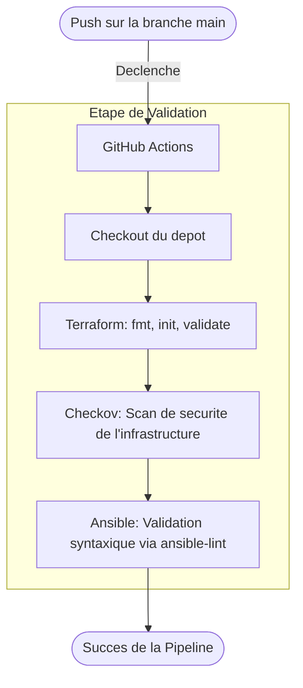

# Projet TP Final Cloud

## Arborescence du Projet

```text
.
├── .github/
│   └── workflows/
│       └── main.yml           # Definition de la pipeline CI/CD 
├── ansible/
│   └── update_lambda.yml      # Playbook Ansible pour le deploiement du code
├── src/
│   ├── handler.py             # Code Python de la fonction AWS Lambda
│   └── requirements.txt       # Dependances Python 
├── terraform/
│   ├── modules/
│   │   ├── lambda/            # Module de provisionnement de la Lambda et IAM
│   │   └── s3/                # Module de creation des buckets (Source/Destination)
│   ├── main.tf                # Point d'entree de l'infrastructure
│   ├── providers.tf           # Configuration AWS (AssumeRole)
│   └── variables.tf           # Definition des variables Terraform
└── requirements.yml           # Dependances Ansible (collections AWS et General)
```

## Architecture de la Pipeline CI/CD



