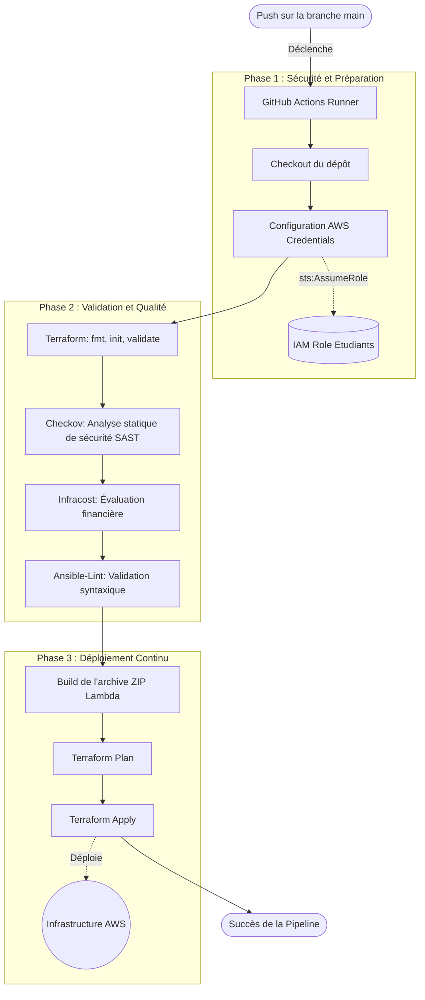

# Projet Final Cloud & DevOps : Convertisseur d'Images Serverless

## 1. Objectif de l'Infrastructure

Ce dépôt contient l'infrastructure complète et le code source d'une application Cloud orientée événements (Event-Driven), déployée sur Amazon Web Services (AWS) via Terraform et GitHub Actions. L'objectif est de fournir un service de conversion d'images vers PDF entièrement Serverless, hautement disponible et sécurisé.

## 2. Arborescence du Projet

```text
.
├── .github/
│   └── workflows/
│       └── main.yml                  # Définition de la pipeline CI/CD complète
├── ansible/
│   └── update_lambda.yml             # Playbook Ansible pour la configuration du déploiement
├── src/
│   ├── handler.py                    # Code Python natif de la fonction AWS Lambda
│   └── requirements.txt              # Dépendances Python minimalistes
├── terraform/
│   ├── modules/
│   │   ├── lambda/                   # Module de provisionnement de la Lambda et des droits IAM
│   │   └── s3/                       # Module de création des buckets (Source/Destination) sécurisés
│   ├── main.tf                       # Point d'entrée orchestrant les modules d'infrastructure
│   ├── providers.tf                  # Configuration du provider AWS et du Remote Backend S3
│   └── variables.tf                  # Définition des variables (Noms de buckets, région)
├── explication_fichiers.md           # Détail technique du rôle de chaque fichier
├── guide_soutenance.md               # Guide pas à pas pour la présentation orale
├── presentation_technique.md         # Fiche de justification des choix architecturaux
└── README.md                         # Ce fichier
```

## 3. Architecture de la Pipeline CI/CD



## 4. Choix Techniques et DevOps

### Infrastructure as Code (Terraform)
L'intégralité du cycle de vie des ressources cloud est gérée par Terraform de manière modulaire et idempotente. 
Pour autoriser la pipeline CI/CD à déployer les changements de façon autonome sans altérer l'état de l'infrastructure, la mémoire de l'infrastructure (`terraform.tfstate`) est conservée sur un **Remote Backend S3**.

### Déploiement Applicatif (Python Serverless)
La fonction Lambda repose sur une logique Python pure (modules natifs `zlib` et `struct`), excluant l'usage de bibliothèques lourdes compilées en C (telles que `Pillow`). Cette approche élimine le besoin de création de conteneurs Docker pour le build, réduit la taille du package d'exécution et atténue drastiquement le "Cold Start".

### Sécurité Dynamique
L'authentification entre GitHub et AWS s'effectue via des secrets injectés dynamiquement endossant un rôle éphémère (`sts:AssumeRole`). Aucun identifiant de rôle n'est stocké en dur au sein du code Terraform, garantissant le respect des normes de sécurité.

## 5. Déploiement Manuel

Si le développement nécessite un déploiement depuis un poste local, les commandes suivantes s'appliquent :

```bash
cd terraform
terraform init
terraform plan
terraform apply -auto-approve
```

---
*Projet réalisé dans le cadre de l'évaluation Cloud & IAC.*
